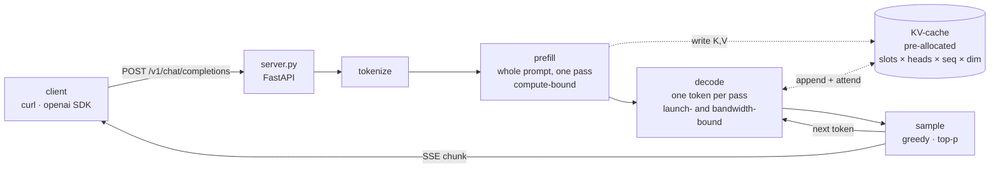
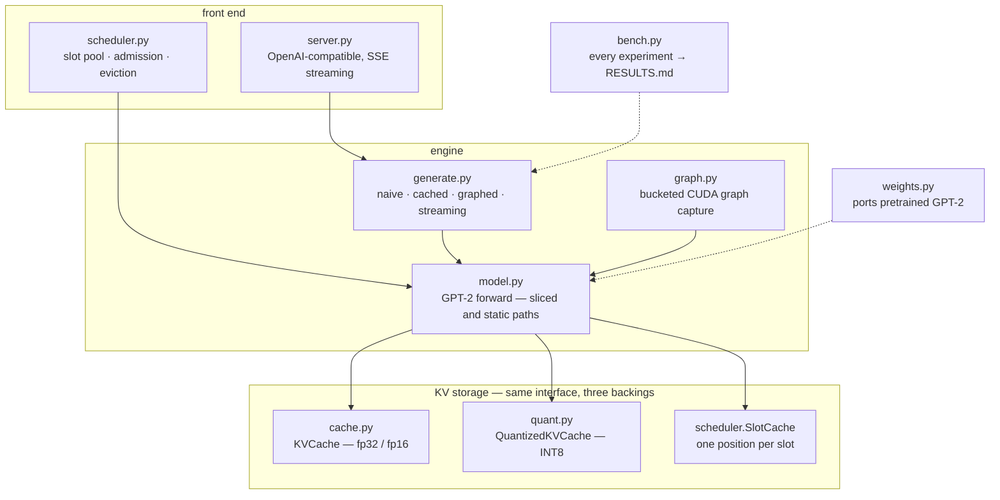
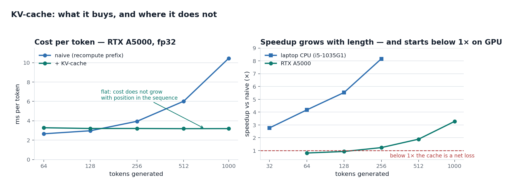
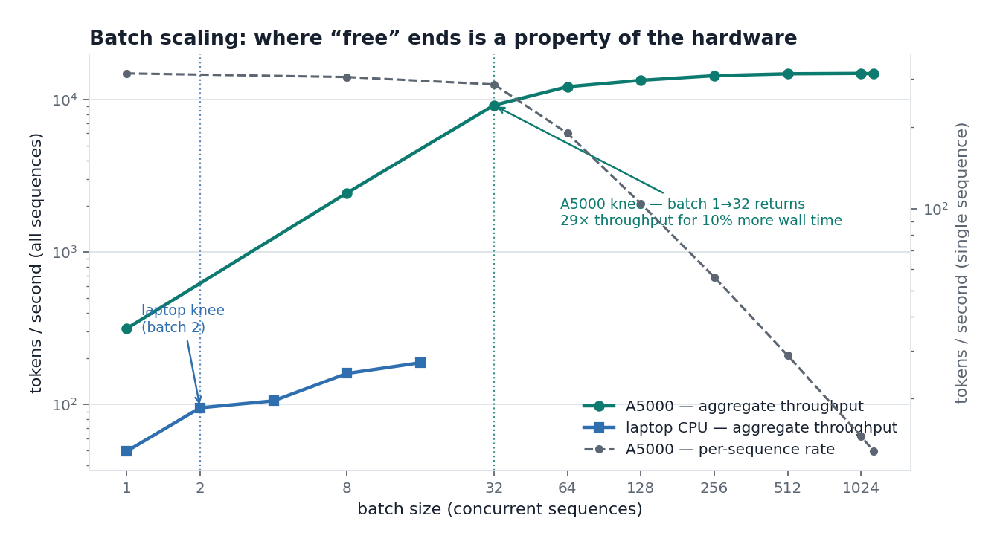
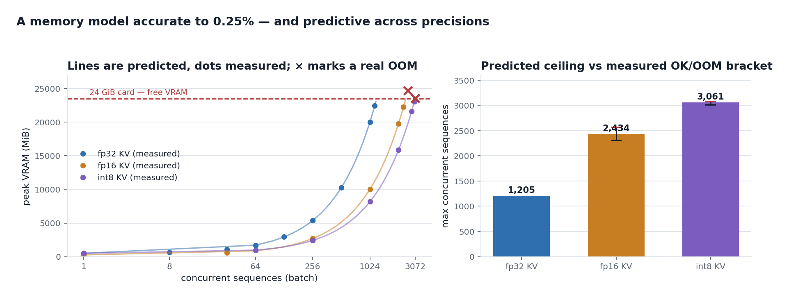
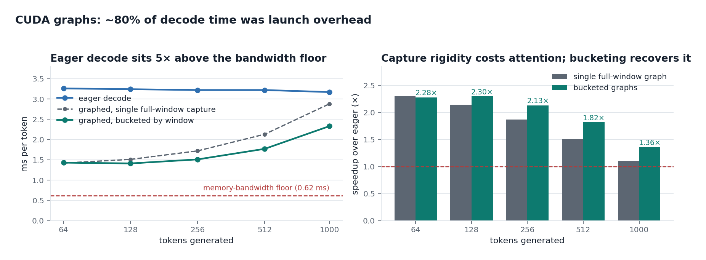
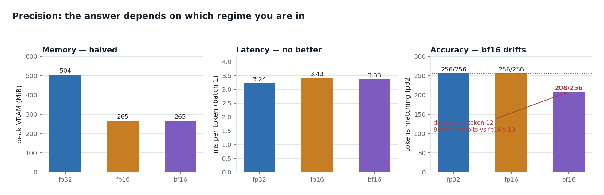
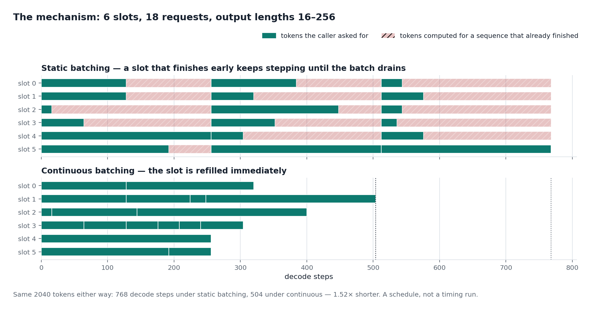
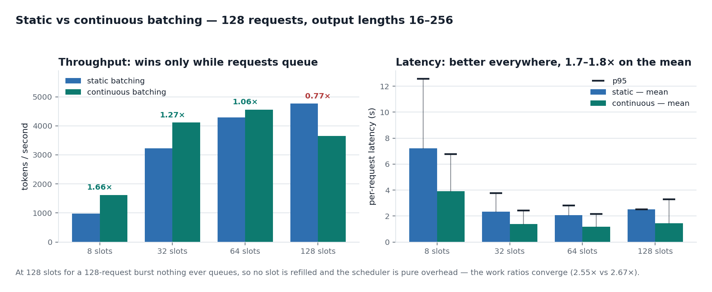

# nanoserve

A GPT-2 inference engine written from scratch, built to measure one thing precisely: **what a KV-cache actually buys you, and what it costs.**

No `transformers.generate()`. The model definition, the attention maths, the cache, the decode loop and the scheduler are all local code — because the interesting engineering in LLM serving lives in exactly the parts a library hides.


*Real capture, played back at 1× — those pauses are the model's actual per-token latency on a laptop CPU. Regenerate with `python scripts/make_demo.py`.*

```bash
pip install -r requirements.txt
pytest                                          # prove it matches real GPT-2
python -m nanoserve.bench kvcache --device cpu  # measure the speedup
uvicorn nanoserve.server:app --port 8000        # serve it
```

```bash
curl -N localhost:8000/v1/chat/completions -H 'Content-Type: application/json' \
  -d '{"messages":[{"role":"user","content":"A KV cache works by"}],"stream":true}'
```

The endpoint is OpenAI-wire-compatible, so the `openai` SDK and any chat UI can point at it unmodified. It is **not hosted anywhere** — clone and run it. Two limits are worth stating plainly: GPT-2 is a base model with no chat template, so the chat schema is accepted but the model completes text rather than converses; and the HTTP layer still serialises requests behind a semaphore, even though the scheduler that would fix it exists.

---

## How a request flows

Two phases, with very different performance characters. **Prefill** processes the whole prompt in one pass — a big matmul per layer, high arithmetic intensity, compute-bound. **Decode** then produces one token per pass, reading every weight in the model to emit a single value, which makes it bandwidth- and launch-bound rather than compute-bound. Almost every result below follows from that asymmetry.



## What's here



The three KV backings expose the same surface — `append`, `advance`, `reset`, `nbytes` — so the forward pass never learns which one it is holding.

## The question

Generating a token requires attending over every previous token. The obvious implementation re-runs the whole prefix each step, so producing *T* tokens costs **O(T²)**. Caching each layer's keys and values makes a step depend only on the new token: **O(T)**.

That is the textbook claim. This repo measures it, then asks the follow-up that matters more in production: *if the cache is free speed, why can't you serve unlimited sequences?* The answer is memory, and the arithmetic is unforgiving.

---

## Results

Full numbers, the memory arithmetic and the analysis are in **[RESULTS.md](RESULTS.md)**. Benchmarked on a 4-core laptop CPU (i5-1035G1) and an RTX A5000. Every plot below is rendered from the recorded measurements by `python scripts/make_plots.py`.

### 1 · The cache makes decode O(1) per step — and can still lose



Cached decode holds a **flat ms/token** across a 16× range in sequence length. That flatness *is* the property, measured directly; it says more than any single speedup number, which depends on the length you happened to pick.

The counterintuitive half: at 64 tokens on the A5000 the cache runs at **0.8×** — slower than recomputing everything. Decode on a small model is *launch*-bound, not compute-bound, so naive's extra arithmetic is free on an idle GPU. The cache only pays once the quadratic term bites.

### 2 · Batching is free until it isn't



Batch 1 → 32 on the A5000 costs 10% more wall time and returns **29× the throughput**. On the laptop the same regime ends at batch **2**. Same code, same model — where "free" ends is a property of the hardware. Past the knee, aggregate throughput flattens while per-sequence latency degrades linearly: the trade a scheduler exists to arbitrate.

### 3 · The cache, not the model, sets the concurrency ceiling



Peak VRAM fits `fixed + per_seq × batch + KV(batch)`, where the fixed term recovers the weights to ~2%. At batch 1024 the cache is **19 GiB of a 20 GiB peak** — larger than the model.

The model is *predictive*, not just descriptive: the fp16 and int8 ceilings (2,434 and 3,061) were computed before those runs and both landed inside their measured OK/OOM brackets, with peak predictions accurate to 0.03–0.25%. It also found a bug — an unexplained 2.16 MiB/sequence term turned out to be the prefill computing logits for prompt positions generation never reads, 2 GiB of waste at batch 1024.

### 4 · Most of decode time was never arithmetic



Eager decode sits 5× above the memory-bandwidth floor; the gap is kernel launch and Python dispatch across 12 layers. Capturing the step into a CUDA graph cuts per-token cost to ~1.4 ms — **2.3×** — and flips result 1: the cache now wins at every length. The cache was never the problem, the dispatch around it was.

Capture is not free, though. It demands constant shapes, so a single graph attends over the whole reserved window from its first token, and the win decays with length. Capturing several graphs at increasing windows and replaying the smallest that fits recovers most of it.

### 5 · Precision: the answer depends on the regime



Half precision halves memory and does **nothing** for single-stream latency — consistent with result 4, since decode at batch 1 is launch-bound rather than arithmetic-bound. At batch, where the workload really is bandwidth-bound, fp16 peaks at 48,392 tok/s against fp32's 14,840: **3.3×**.

fp16 beats bf16 here. Identical memory, but fp16 reproduced all 256 fp32 tokens exactly while bf16 diverged at token 12 — it spends 8 bits on mantissa to fp16's 10, and GPT-2's inference activations do not need the extra range. The "prefer bf16" habit comes from *training*, where gradient range matters.

### 6 · Continuous batching helps when there is a queue



The mechanism, as a schedule: under static batching a sequence that finishes early keeps stepping until its whole batch drains. The hatched area is tokens computed for sequences that already finished.



With 8 slots for 128 requests, continuous batching computes 1.05× the tokens asked for against static's 2.36×, and throughput follows at **1.66×**. As the pool grows the advantage decays, and at 128 slots for a 128-request burst it **reverses** — nothing ever queues, no slot is ever refilled, and the scheduler becomes pure overhead.

Latency is the unambiguous half: **1.7–1.8× better mean at every configuration**, including where throughput loses. Note the 128-slot column — static gives every request an identical 2.51 s because they all finish together. Static batching does not make requests fast, it makes them *uniformly slow*, which flatters p95 while being worse for nearly every individual caller.

---

## Correctness first

A fast decoder that produces different tokens is not an optimisation, so every benchmark is gated behind the test suite:

```
$ pytest -q
18 passed        # on a CUDA box — the CUDA-graph test skips without one
```

Local logits match HuggingFace GPT-2 to `< 1e-3`; cached, graphed, int8 and scheduled decode all reproduce the naive path token for token; a cache overflow raises rather than silently corrupting; and slots stay independent across admission, eviction and reuse.

Four things cost real debugging time and are worth flagging to anyone reading the code:

- **HuggingFace stores GPT-2's projections as `Conv1D`**, whose weight is the transpose of what `nn.Linear` expects. Get it wrong and the model still runs, still emits fluent-looking text, and is simply wrong. `weights.py` decides from the tensor shape rather than trusting a convention.
- **A cached prefill needs an offset causal mask.** During decode (`q_len == 1`) no mask is needed at all, since every cached key precedes the query — but prefilling *into a non-empty cache* puts the causal boundary at an offset, where `is_causal=True` masks the wrong cells.
- **Device-to-host syncs hide inside innocent code.** `int(token.item())` per slot per step cost more than the decode it was reporting; so did reading the cache position back to choose a graph bucket. Both are now tracked host-side and reconciled once per generation.
- **Two benchmark traps produced confidently wrong numbers** before being caught — cache allocation inside the timed region, and allocator reservations faking an OOM at half the true capacity. Written up in [RESULTS.md §9](RESULTS.md).

## Running on a GPU

Code stays local and authoritative; a remote box is a disposable executor, so no commit is needed to run an experiment.

```bash
cp scripts/remote.env.example scripts/remote.env   # host details (gitignored)
./scripts/remote.sh setup                          # remote venv + deps
./scripts/remote.sh bench all --device cuda        # sync, run, fetch results/
```

## Roadmap

- [x] GPT-2 from scratch, parity-tested against the reference
- [x] Pre-allocated KV-cache, naive vs cached benchmark
- [x] Batch-scaling and memory-footprint experiments
- [x] GPU numbers: batch saturation curve, VRAM-limited OOM boundary
- [x] Precision study: fp32 / fp16 / bf16 — memory, speed, and token agreement
- [x] CUDA graphs, bucketed by attention window — 2.3× faster decode
- [x] INT8 KV cache — 2.5× the concurrency, exact token agreement
- [x] Streaming OpenAI-compatible HTTP endpoint
- [x] Continuous batching — 1.66× throughput and 1.8× lower mean latency under a queue
- [ ] Wire the scheduler into the HTTP endpoint (it still serialises requests)
- [ ] Staggered arrivals, rather than admitting a whole burst at t=0
- [ ] INT8 attention kernels, to remove the dequantise-on-read cost

## License

MIT
