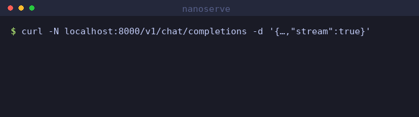

# nanoserve

A GPT-2 inference engine written from scratch, built to measure one thing precisely: **what a KV-cache actually buys you, and what it costs.**

No `transformers.generate()`. The model definition, the attention maths, the cache and the decode loop are all local code — because the interesting engineering in LLM serving lives in exactly the parts a library hides.



*Real capture, played back at 1x — those pauses are the model's actual per-token latency on a laptop CPU. Regenerate with `python scripts/make_demo.py`.*

```bash
pip install -r requirements.txt
pytest                                          # prove it matches real GPT-2
python -m nanoserve.bench kvcache --device cpu  # measure the speedup
uvicorn nanoserve.server:app --port 8000        # serve it
```

```bash
curl -N localhost:8000/v1/chat/completions -H 'Content-Type: application/json' \
  -d '{"messages":[{"role":"user","content":"A KV cache works by"}],"stream":true}'
```

The endpoint is OpenAI-wire-compatible, so the `openai` SDK and any chat UI can point at it unmodified. It is **not hosted anywhere** — clone and run it. Two limits are worth stating plainly: GPT-2 is a base model with no chat template, so the chat schema is accepted but the model completes text rather than converses; and requests are serialised one at a time, which is exactly what continuous batching would fix.

## The question

Generating a token requires attending over every previous token. The obvious implementation re-runs the whole prefix each step, so producing *T* tokens costs **O(T²)**. Caching each layer's keys and values makes a step depend only on the new token: **O(T)**.

That is the textbook claim. This repo measures it, then asks the follow-up question that matters more in production: *if the cache is free speed, why can't you serve unlimited sequences?* The answer is memory, and the arithmetic is unforgiving.

## What's here

| Module | Role |
|---|---|
| `nanoserve/model.py` | GPT-2 — attention, MLP, blocks — written out in full |
| `nanoserve/cache.py` | Pre-allocated per-layer K/V store, with explicit memory accounting |
| `nanoserve/generate.py` | Two decode loops: `generate_naive` (no cache) and `generate_cached` |
| `nanoserve/weights.py` | Ports pretrained GPT-2 weights, shape-checking every tensor |
| `nanoserve/bench.py` | Benchmark harness; emits markdown straight into `RESULTS.md` |
| `nanoserve/quant.py` | INT8 KV store, per-token symmetric scales |
| `nanoserve/graph.py` | Bucketed CUDA graph capture of the decode step |
| `nanoserve/server.py` | OpenAI-compatible HTTP endpoint with SSE streaming |
| `tests/` | Correctness gates (see below) |

## Correctness first

A fast decoder that produces different tokens is not an optimisation, so the benchmarks are gated behind five tests:

1. Local logits match HuggingFace GPT-2 to `< 1e-3`.
2. Cached decode matches naive decode.
3. Feeding tokens one at a time matches a single full-sequence pass.
4. Overflowing the reserved cache raises, rather than silently corrupting.
5. Skipping the vocab projection on unread positions preserves the token ranking.

```
$ pytest -q
5 passed
```

Two details cost real debugging time and are worth flagging for anyone reading the code:

- **HuggingFace stores GPT-2's projections as `Conv1D`**, whose weight is the transpose of what `nn.Linear` expects. Get it wrong and the model still runs, still emits fluent-looking text, and is simply wrong. `weights.py` decides from the tensor shape rather than trusting a convention.
- **A cached prefill needs an offset causal mask.** During decode (`q_len == 1`) no mask is needed at all, since every cached key precedes the query. But prefilling *into a non-empty cache* puts the causal boundary at an offset, where `is_causal=True` masks the wrong cells.
- **Two benchmark traps produced confidently wrong numbers** before being caught — cache allocation inside the timed region, and allocator reservations faking an OOM at half the true capacity. Both are written up in [RESULTS.md §6](RESULTS.md).

## Results

Measured numbers, the memory arithmetic, and the analysis live in **[RESULTS.md](RESULTS.md)** — benchmarked on a 4-core laptop CPU and an RTX A5000.

Cached decode holds a **flat ms/token** regardless of position in the sequence — 3.2 ms on an RTX A5000, ~20 ms on a 4-core laptop CPU. That flatness *is* the O(1)-per-step property, measured directly.

Three findings that a single speedup number would have hidden:

**The cache can lose — until you fix the dispatch.** At 64 tokens on the A5000 it runs at **0.8×**, slower than recomputing everything. Decode on a small model is launch-bound, not compute-bound: 3.2 ms/token against a 0.6 ms bandwidth floor. Capturing the step into a **bucketed CUDA graph** cuts it to 1.4 ms/token (**2.3×**) and the cache wins at every length again. The cache was never the problem; the dispatch around it was.

**Batching is free until it isn't.** Batch 1 → 32 on the A5000 costs 10% more wall time for **29× the throughput**. On the laptop that regime ends at batch **2**. Same code, same model — the knee is a property of the hardware.

**The cache is what stops you serving more.** At batch 1024 it is 19 GiB of a 20 GiB peak. A fitted memory model predicts the concurrency ceiling to within 0.25%, and predicted fp16's ceiling (2,434) landed inside the measured bracket (2,304 OK, 2,560 OOM) before it was measured.

## Running on a GPU

Code stays local and authoritative; a remote box is treated as a disposable executor, so no commit is needed to run an experiment.

```bash
cp scripts/remote.env.example scripts/remote.env   # fill in host details (gitignored)
./scripts/remote.sh setup                          # remote venv + deps
./scripts/remote.sh bench all --device cuda        # sync, run, fetch results/
```

## Roadmap

- [x] GPT-2 from scratch, parity-tested against the reference
- [x] Pre-allocated KV-cache, naive vs cached benchmark
- [x] Batch-scaling and memory-footprint experiments
- [x] GPU numbers: batch saturation curve, VRAM-limited OOM boundary
- [x] Precision study: fp32 / fp16 / bf16 — memory, speed, and token agreement
- [x] CUDA graphs, bucketed by attention window — 2.3x faster decode
- [x] INT8 KV cache — 2.5x the concurrency, exact token agreement
- [x] Streaming OpenAI-compatible HTTP endpoint
- [ ] Continuous batching: admit new sequences mid-flight instead of padding to the longest

## License

MIT
